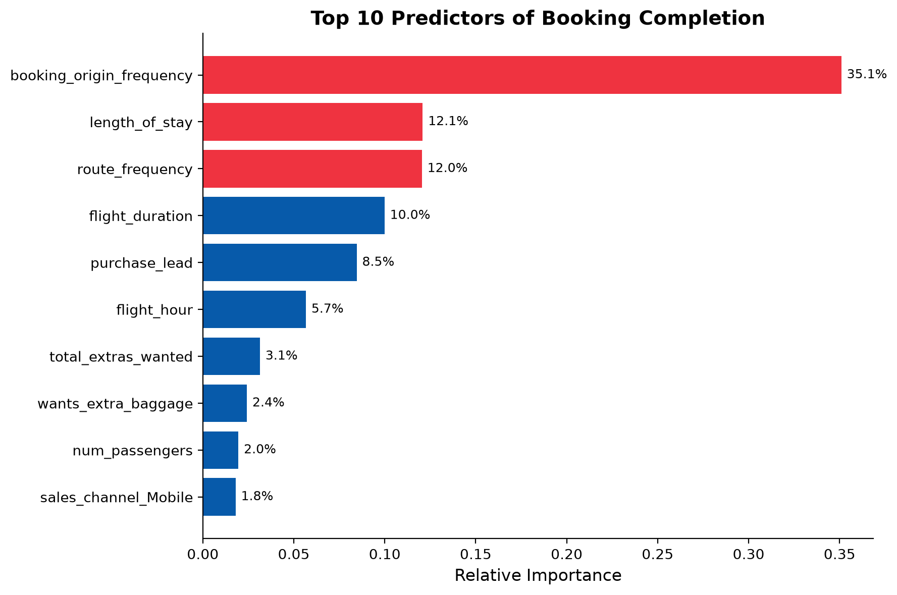

# British Airways — Customer Booking Prediction

A machine learning project predicting whether a customer will complete a flight booking, based on their search and preference data — built as part of the British Airways Data Science (Forage) virtual experience.

## Business Problem

Airlines can no longer wait until a customer reaches the airport to try to sell them a holiday — by then, it's too late. This project builds a predictive model that flags customers who are likely to complete a booking, so British Airways can proactively target them earlier in the buying journey.

## Dataset

50,000 customer booking search records, including trip details (route, duration, passengers), booking behaviour (purchase lead time, sales channel), and preferences (extra baggage, preferred seat, in-flight meals). Only ~15% of records resulted in a completed booking — a real-world, imbalanced classification problem.

## Approach

1. **Feature engineering** (`01_prepare_data.py`)
   - Frequency-encoded high-cardinality fields (`route`, `booking_origin`) to avoid dimensionality blow-up from one-hot encoding
   - One-hot encoded low-cardinality categoricals (`sales_channel`, `trip_type`, `flight_day`)
   - Engineered new features: `total_extras_wanted` (sum of requested add-ons) and `is_weekend_flight`

2. **Model training** (`02_train_evaluate.py`)
   - Random Forest Classifier, chosen for interpretability via feature importance
   - `class_weight='balanced'` to handle the 85/15 class imbalance
   - 5-fold stratified cross-validation, evaluated on a held-out test set

3. **Visualization** (`03_create_chart.py`)
   - Feature importance bar chart showing which variables drive predictions

4. **Business summary** (`04_create_slide.py`)
   - Single-slide PowerPoint summarizing findings for a non-technical audience

## Results

| Metric | Score |
|---|---|
| ROC-AUC | 0.77 |
| Recall | 72% |
| Precision | 29% |
| Accuracy | 70% |

The model meaningfully distinguishes likely bookers from non-bookers (ROC-AUC well above the 0.50 random baseline) and catches 72% of customers who go on to book. Precision is lower, which is expected given how rare bookings are in the data (15% base rate) — the trade-off favors *not missing* likely bookers over avoiding false positives, which fits a proactive-targeting use case.

### Top predictors of booking completion

Booking origin, route popularity, and length of stay were the strongest signals — day of week and trip type contributed very little.

## Tools

Python, pandas, scikit-learn, matplotlib, python-pptx

## Files

- `01_prepare_data.py` – data cleaning & feature engineering
- `02_train_evaluate.py` – model training, cross-validation, evaluation
- `03_create_chart.py` – feature importance visualization
- `04_create_slide.py` – PowerPoint summary generation
- `outputs/` – prepared data, chart, metrics, and final slide